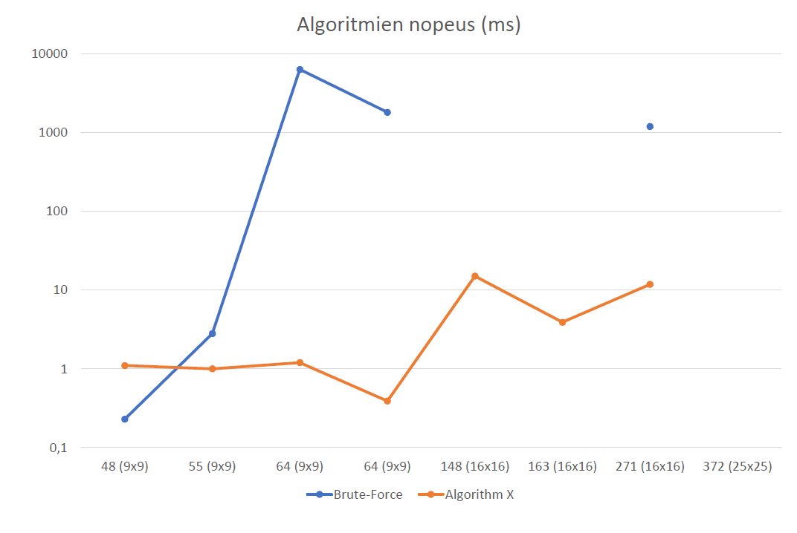

# Sudokusolver - testausdokumentti

## Mitä on testattu, miten tämä tehtiin
Ohjelmassa on kattavat yksikkötestit algoritmin oikeellisuuden testaamiseksi (9x9 ja 25x25 sudokut). Jacoco testikattavuus on 72% sisältäen Main luokan, johon ei ole yksikkötestejä.

Lisäksi ohjelman nopeutta on testattu sudukoilla, joissa on eri määrä tyhjiä ruutuja. Samoin ohjelmaa on testattu eri kokoisilla sudokuilla (9x9, 16x16, 25x25). Testiaineistossa on kuitenkin vain kuusi sudokua, jotka ovat suurempia kuin 9x9. 

9x9 testiaineisto on ladattu [Kjell Ericsonin sivuilta](https://kjell.haxx.se/sudoku/). 

## Minkälaisilla syötteillä testaus tehtiin
Ohjelman testauksessa käytettiin seuraavia aineistoja:

1. 6 kappaletta 9x9 sudokua, jossa 48 tyhjää ruutua (3_level48.ss)
1. 7 kappaletta 9x9 sudokua, jossa 55 tyhjää ruutua (3_level55.ss)
1. 6 kappaletta 9x9 sudokua, jossa 64 tyhjää ruutua (3_level64.ss)
1. Yksi 9x9 sudoku, jossa 60 tyhjää ruutua (3_worldsHarderst60.ss)
1. 100 kappaletta 9x9 sudokua, jossa  64 tyhjää ruutua (3_100sudokua64.ss)
1. Yksi 16x16 sudoku, jossa 148 tyhjää ruutua (4_level148.ss)
1. Kolme 16x16 sudokua, jossa 163 tyhjää ruutua (4_level163.ss)
1. Yksi 25x25 sudoku, jossa 271 tyhjää ruutua (5_level271.ss)
1. Yksi 25x25 sudoku, jossa 372 tyhjää ruutua (5_level372.ss)

## Miten testit voidaan toistaa
Testiaineisto on kansiossa "testidata". Siellä on lisäksi tiedosto johon on lisätty 21 erikokoista sudokua.

Testin voi toistaa esimerkiksi näin:

```
java -jar target/Sudokusolver-1.0-SNAPSHOT.jar testidata/3_100sudokua64.ss
```

## Ohjelman toiminnan empiirinen testaus

Suoritusajat (yksi sudoku keskimäärin). Testikone: AMD Ryzen 5 2600X, Kubuntu 19.10

| koko | tyhjat solut | lukumäärä  | Brute-Force | Algorithm X  | 
| :----:|:-----| :-----|:-----| :-----|
|9x9|48|6|0,23ms|1,1ms|
|9x9|55|7|2,8ms|1,0ms|
|9x9|64|6|6,3s|1,2ms|
|9x9|64|100|1,8s|0,39ms|
|16x16|148|1|ei ratkea|15ms|
|16x16|163|3|ei ratkea|3,4ms|
|25x25|271|1|1,19s|11,8ms|
|25x25|372|1|ei ratkea|ei ratkea|



9x9 sudokuissa huomaa miten linkitetyn matriisin valmistelu vie leijonanosan ajasta. Valmistelun aikavaativuus riippuu näissä tilanteissa käytännössä sudokun koosta, ei tyhjien solujen määrästä.

16x16 sudokujen ero on myös mielenkiintoinen. Vaikka toisessa kolmen sudokun aineistossa on tyhjiä soluja enemmän, aikavaatimus on huomattavasti pienempi. Tämä johtuu siitä, että niiden ratkaisemissa ei tule haarautumia. Sen sijaa sudokussa 4_level148.ss tulee paljon haarautumia (266). 

Sudukussa 5_level372.ss haarautumia tulee valtava määrä. 20 minuutissa noin 56 miljoonaa.

100 sudokun patterin testissä mielenkiintoinen ilmiö: 28 ensimmäistä sudokua valmisteluvaihe vie luokkaa 0,5ms ja sen jälkeen luokkaa 0,1ms? Liekö jokin välimuistikysymys?
