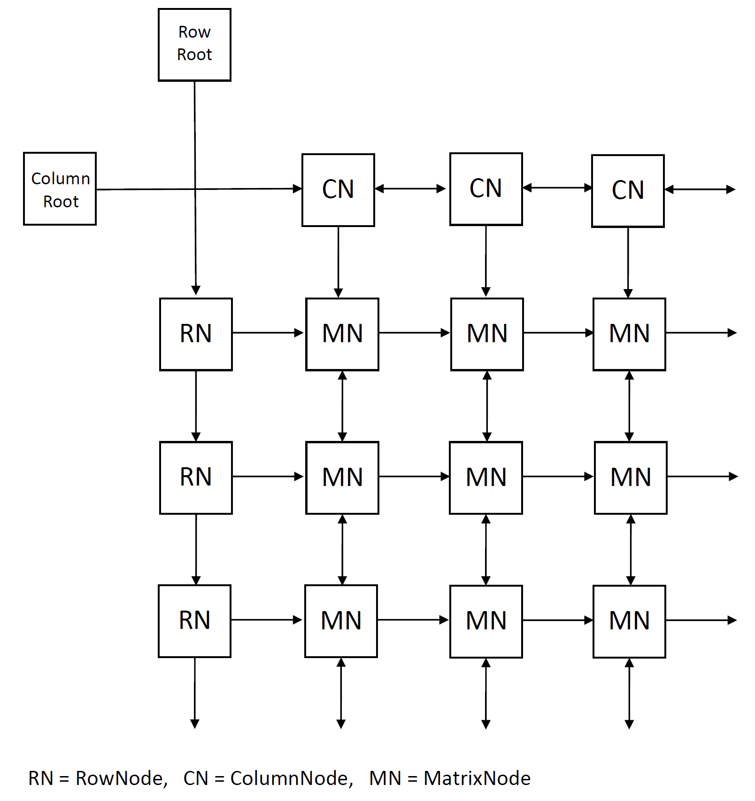

# Sudokusolver - toteutusdokumentti

## Ohjelman yleisrakenne
Ohjelman Main-luokka toteuttaa tiedoston lukemisen ja kahden algoritmin (Algorithm X ja Brute-Forece) suorittamisen yksi kerrallaan jokaiselle tiedostossa olevalle sudokulle. 

Grid -luokan olio kuvaa sudoku-ruudukkoa.

BruteFore -luokan metodit toteuttaa BruteForce haun, joska myös hyödyntää Grid-luokan metodia checkCell. AlgorithmX -luokan metodit toteuttavat Algorithm X haun.

### Brute-Force
Tämä algoritmi käy läpi rekursiivisesti syvyyshaulla kaikki sudokun tyhjät ruudut. Syvyyshaussa sudokun tyhjiä soluja lähdetään täyttämään vasemmasta yläkulmasta riveittäin. Pienimmästä numerosta suurimpaan. Yhden haaran haku pysähtyy, mikäli seuraavaan soluun ruutuun ei voi lisätä mitään numeroa (jokaisen numeron osalta tarkistetaan ettei samaa numeroa ole ryhmässä, rivillä tai sarakkeessa). Haku päättyy kun kaikkiin soluihin on saatu numero.

Algoritmin nopeus riippuu huomattavassa määrin sattumasta. Jos ruudukon alussa on paljon tyhjiä ruutuja joihin on monta vaihtoehtoa, syntyy syvyyshaun juureen monia raskaasti läpikäytäviä haaroja.

### Algorithm X
Tässä algoritmissa sudoku ratkaistaan siten, että se kuvataan [täydellinen peite -ongelmana](https://en.wikipedia.org/wiki/Exact_cover). Täydellinen peite etsitään [Knuths Algorithm X](https://en.wikipedia.org/wiki/Knuth%27s_Algorithm_X) -agoritmilla.

**Täydellinen peite -ongelmassa** pyritään löytämään sellainen joukon osajoukkojen kombinaatio, jossa jokainen joukon alkio on edustettu yhden ja vain yhden kerran.

Kun sudoku kuvataan täydellinen peite -ongelmana, on osajoukkoina jokaisen solun jokainen mahdollinen numero. Tyhjässä sudokussa osajoukkoja on siten 9x9x9 = 729. 

Joukon alkiot ovat puolestaan rajoitteita. Esimerkiksi rivillä 3 pitää olla alkio 2. Tai rivin 4 sarakkeessa 5 voi olla vain yksi numero. 

Rajoitteet:
1) Yhdessä solussa voi olla vain yksi numero
2) Yhdellä rivillä pitää esiintyä jokainen numero vain kerran
3) Yhdellä sarakkeella pitää esiintyä jokainen numero vain kerran
4) Yhdessä ryhmässä pitää esiintyä jokainen numero vain kerran

Näin muodostuu 4x81 = 324 rajoitetta. Vastauksessa jokainen näistä rajoitteista pitää esiintyä täsmälleen kerran.

Jokainen osajoukko kuvaa siis yhtä vaihtoehtoa (esimerkiksi rivin 2 sarakkeessa 7 on luku 9). Osajoukko muodostuu neljästä rajoitteesta (rivin 2 sarakkeessa on luku, rivillä 2 on luku 9, sarakkeessa 7 on luku 9, ryhmässä 3 on luku 9).

Tämän avulla luodaan binääritaulukko jossa on 729 riviä ja 324 saraketta. Rivit on vaihtoehtoja ja sarakkeet rajoitteita. Täydellinen peite on siis sellainen joukko rivejä, joissa yhteensä esiintyy jokainen sarake täsmälleen kerran.

Tässä ohjelmassa taulukko on toteutettu linkitettyinä listoina. Jokainen täysi solu on linkitetty oikeaan, alempaan ja ylempään täyteen soluun. Tyhjät solmut on jätetty taulukosta kokonaan pois.



Tämä ratkaisu antaa kaksi etua: taulukon koko on pienempi, koska tyhjät solut eivät vie tilaa. Taulukkossa suurin osa soluista on tyhjä. Toisekseen tämä antaa mahdollisuuden tehokkaasti poistaa ja palauttaa soluja taulukkoon, joka on keskeistä Algorithm X:lle.

**Algorithm X** toimii rekursiivisesti. Sille annetaan taulukko. Jos taulukossa ei ole ollenkaan sarakkeita (eli kaikki sarakkeet on jo ratkaisussa), täydellinen peite on löydetty.

Muuten valitaan sarake, jossa on vähiten soluja. Jos sarake on tyhjä, täydellistä peitettä ei voida tällä osaratkaisulla saavuttaa. Kaydään läpi kaikki rivit joissa esiintyy tämän sarakkeen solu.

Jokaisen tällaisen rivin osalta tehdään seuraava: Otetaan rivi osaksi ratkaisua. Poistetaan taulukosta kaikki sarakkeet joissa esiintyy rivin solu. Poistetaan myös kaikki rivit joissa esiintyy jokin näistä sarakkeista. Lopuksi annetaan tämä karsittu taulukko rekursiivisesti algoritmin syötteeksi. 

Algoritmin kuvaus Wikipipediasta (https://en.wikipedia.org/wiki/Knuth%27s_Algorithm_X): 

```
1. If the matrix A has no columns, the current partial solution is a valid solution; terminate successfully.
2. Otherwise choose a column c (deterministically).
3. Choose a row r such that A(r, c) = 1 (nondeterministically).
4. Include row r in the partial solution.
5. For each column j such that A(r, j) = 1,
    for each row i such that A(i, j) = 1,
        delete row i from matrix A.
    delete column j from matrix A.
6. Repeat this algorithm recursively on the reduced matrix A.
```

## Saavutetut aika- ja tilavaativuudet
Keskeinen vaativuutta määrittelemä tekijä on tyhjien solujen määrä (n). Toinen tärkeä tekijä on ruudukon koko (k).

### Brute-force
**Tilavaatimus** on varsin pieni. Algoritmi vaatii yhden Grid tyyppisen olion. Funktio kutsutaan rekursiivisesti enintään n kertaa yhtä aikaa. Tilavaativuus siis riippuu tyhjien solujen määrästä ja on luokkaa O(n)?

Brute-force algoritmin **aikavaativuus** riippuu tyhjien solujen lukumäärästä. Teoriassa kokeiluja joudutaan tekemään huonoimmassa tapauksessa k^n kertaa, mutta käytännössä yhden haaran läpikäynti pysähtyy huomattavasti ennen kuin päästään haaran loppuun asti. Jokaisen luvun kokoeileminen vaatii maksimissaan 3k tarkistusta (esiintyykö luku jo samalla rivillä, sarakkeessa tai ryhmässä). Aikavaativuus riippuu tyhjien ruutujuen lukumäärästä ja on luokkaa O(2^n).

### Algortihm X
**Tilavaatimus** on maltillinen. Matriisi vie tilaa luokkaa k³. Rekursiivinen funktion kutsutaan enintään n kertaa kerrallaan. Eli tilavaativuus riippuu ruudukon koosta ja on luokkaa O(n³) 

Algoritmin **aikavaativuus** rippuu teoriassa suurimmaksi osaksi tyhjien ruutujen lukumäärästä. Algoritmi käy läpi Brute-Force algoritmin tavoin maksimissaan jokaisen mahdollisuuden tyhjiin ruutuihin. Käytännössä useimmiten algoritmi valitsee seuraavaksi kokeiltavaksi sudokun soluksi sellaisen jossa on vain yksi vaihtoehto. Näin aikavaativuus on luokkaa n. Mutta vaikeimmissa sudokuissa osassa askeleista valitaan sudokun solu, jossa on 2 vaihtoehtoa. Tällöin hakupuu haarautuu. Kaikissa muissa testiaineiston sudokuissa haarautumia on enintään maltillisesti, mutta sudokussa 5_level372.ss näitä on valtavasti, joka tekee hakupuusta erittäin suuren.

Yksi askel hakupuussa vaatii jonkin verran laskentaa. Joka kierroksella poistetaan enintään 4*4*k solua. Mikäli puussa peruutetaan niin ne myös palautetaan. 

Muissa paitsi ratkeamattomassa sudokussa matriisin valmistelu on aikaavievin osa. Sen aikavaativuus on luokkaa k³. Siksi käytännössä algoritmin viemä aika ei riipukaan tyhjien solujen määrästä, vaan sudokun koosta O(n³).

Vaativissa sudokuiss aikavaativuus riippuu tyhjien ruutujuen lukumäärästä ja erityisesti sudokun vaativuudesta, ja on pahimmillaan luokkaa O(2^n).

## Suorituskyky- ja O-analyysivertailu
**Tilavaativuudeltaan** Brute-Force tilavaativuus on pienempi. Ruudukon koon mukaan tilavaativuus on sillä O(n²). AlgorithmX tilavaativuus on O(n³).
**aikavaativuudeltaan** algoritmit ovat teoriassa samaa luokkaa O(2^n), mutta Algorithm X on käytännössä huomattavasti tehokkaampi. Tehokkuutta tuo ainakin se, että algoritmi tekee valinnan seuraavaksi kokeiltavaksi ruuduksi sen, johon on vähiten vaihtoehtoja, jolloin syvyyshaku on kevvyempi. Se myös tehokkaammin havaitsee mitkä ovat mahdollisia vaihtoehtoja solun arvoksi. 

## Työn mahdolliset puutteet ja parannusehdotukset


## Lähteet
* [Wikipedia: Sudoku solving algorithms](https://en.wikipedia.org/wiki/Sudoku_solving_algorithms)
* [Wikipedia: Exact cover](https://en.wikipedia.org/wiki/Exact_cover)
* [Wikipedia: Knuth's Algorithm X](https://en.wikipedia.org/wiki/Knuth%27s_Algorithm_X)
